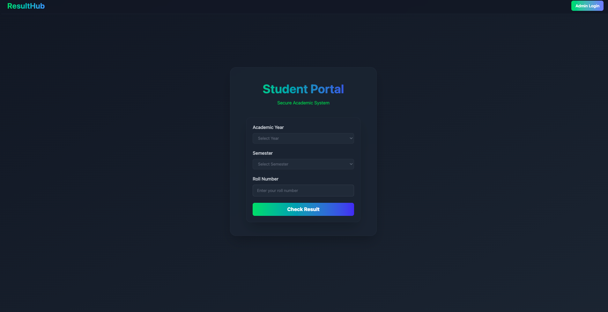

# ResultHub


**ResultHub** is a modern web-based platform designed to simplify result checking, comparison, and management for students and administrators.  
With its user-friendly interface, automated result builder, and interactive visualizations, ResultHub makes academic performance tracking easy, efficient, and engaging.

---

## 🌐 Live Demo  
🔗 **[Visit ResultHub](https://result-calculator-omega.vercel.app)**

---

## 📸 Screenshots

### Home Page
The landing page offers quick access to both **Student Login** and **Admin Login**.  


---

## 🎓 Student Workflow

### 1. Student Login
Students can log in by entering:
- Roll Number
- Semester
- Academic Year (e.g., `2022-2026`)

Once details are filled, clicking **Check Result** redirects to the **Result Page**.

---

### 2. Result Page
Displays the student’s marks and performance in a clean, readable format.  


---

### 3. Result Comparison
A unique feature of ResultHub — students can compare their results with another student’s by entering the other student’s roll number.  

#### Comparison Input Section:


#### Comparison Result (Bar Chart View):
Interactive bar charts visually compare marks and percentages.  


---

## 🛠 Admin Workflow

### 1. Admin Login
Separate secure login portal for administrators.  


---

### 2. Result Builder
Admins can register new students and add their results to the database.  
- Auto-fetch subjects based on **Year**, **Semester**, and **Branch**.
- Only marks need to be entered, making data entry faster and more organized.


---

## ✨ Features

- **Dual Login System**: Separate portals for students and admins.
- **Instant Result Retrieval**: Students can check their results in seconds.
- **Result Comparison**: Compare performance between two students with interactive bar charts.
- **Smart Result Builder**: Auto-fetch subjects to save admin time.
- **Responsive UI**: Works smoothly on both desktop and mobile devices.

---

## 🧰 Tech Stack

- **Frontend**: [TypeScript](https://www.typescriptlang.org/)  
- **Backend & Storage**: [Firebase](https://firebase.google.com/) (Authentication, Firestore Database, Hosting)  
- **Styling**: [Tailwind CSS](https://tailwindcss.com/)  
- **Build Tool**: [Vite](https://vitejs.dev/)  

---

## 📂 Project Structure

- `public/` → Contains static assets like `logo.png` and screenshots.
- `src/` → Application source code (components, pages, styles).
- `index.html` → Entry HTML file.

---

## 🚀 Getting Started

### Prerequisites
- **Node.js** (v16+)
- **npm** or **yarn**

### Installation
```bash
# Clone the repository
git clone https://github.com/yourusername/resulthub.git

# Navigate to the project folder
cd resulthub

# Install dependencies
npm install

# Start development server
npm run dev
